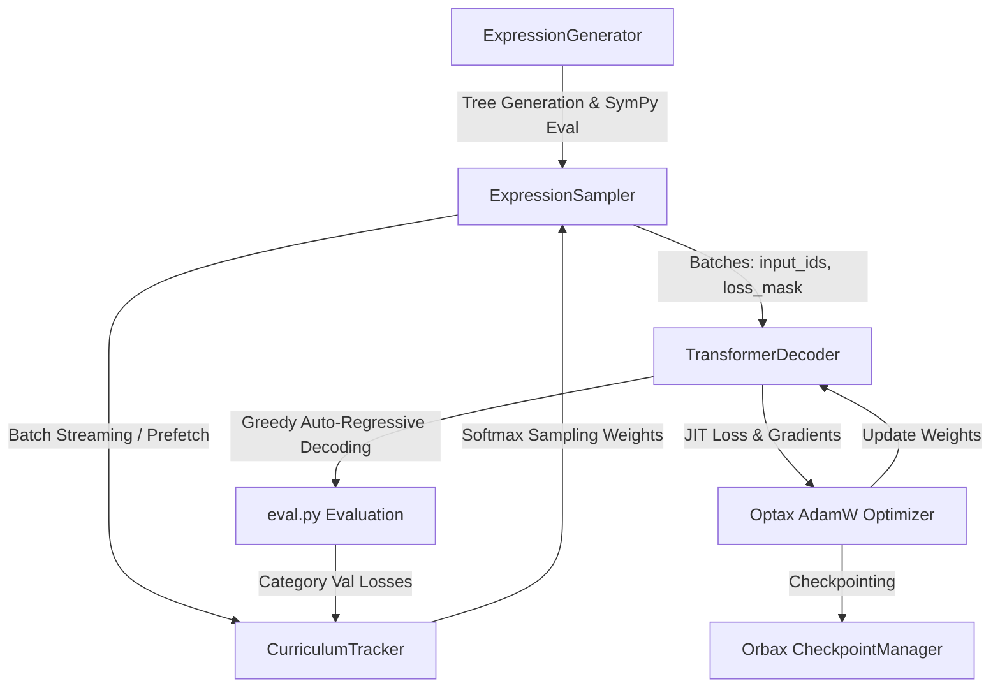

# Mathematical Transformers Codebase Memory Book

> **System Memory & Architectural Guide for `math-transformers`**  
> A JAX/Flax implementation of a Pre-LN Decoder-Only Transformer for symbolic mathematical reasoning with adaptive curriculum data generation.

---

## 1. Executive Summary & Core Philosophy

The `math-transformers` codebase is designed to train neural networks to compute mathematical expressions (arithmetic, trigonometry, logarithms, exponentials, roots, and nested compositions) directly from string prompts.

### Key Architectural Tenets
1. **Decoder-Only Unified Sequence Model**: Eliminates separate encoder-decoder networks by treating math evaluation as sequence completion: `BOS <expression> SEP <target> EOS PAD...`.
2. **Selective Target Loss Masking**: Attention is causal across the whole sequence, but backpropagation gradients are computed exclusively on tokens *after* the `SEP` token up to `EOS`.
3. **Digit-by-Digit Tokenization**: Numbers are split into individual digit tokens to prevent vocabulary explosion and force positional base-10 value representation learning.
4. **Adaptive Curriculum Learning Engine**: Dynamically shifts training sample distributions toward categories with higher validation loss while actively suppressing overfitted tasks and preventing task starvation.
5. **Device-Agnostic Scalability**: Runs CPU-only smoke tests seamlessly and scales to GPU hardware with `bfloat16` mixed precision and sinusoidal position embeddings.

---

## 2. System Architecture & Conceptual Diagrams

### 2.1 Sequence Format & Attention Masking

```text
Input Sequence:
 Token ID: [BOS]  "s" "i" "n" "(" "0" "." "5" ")" [SEP]  "0" "." "5" [EOS] [PAD] ...
 Loss Mask:  0     0   0   0   0   0   0   0   0    0     1   1   1    1     0   ...
                                                    ^
                                                    |-- Gradients computed only here
```

### 2.2 System Data Flow



---

## 3. Detailed Component Map

### 3.1 Tokenizer (`src/tokenizer/`)
- **[tokenizer.py](file:///r:/ML/math-transformers/src/tokenizer/tokenizer.py)**: `Tokenizer` class. Uses regex matching to extract special tokens (`PAD`, `BOS`, `EOS`, `SEP`), multi-character function names (`sin`, `cos`, `tan`, `log`, `ln`, `exp`, `sqrt`, `abs`), and individual non-whitespace characters (digits `0-9`, `.`, `-`, `+`, `*`, `/`, `^`, `(`, `)`).
- **[vocab.json](file:///r:/ML/math-transformers/src/tokenizer/vocab.json)**: Fixed 30-token dictionary mapping strings to integer IDs.

| Token ID Range | Tokens | Description |
|---|---|---|
| `0 - 3` | `PAD`, `BOS`, `EOS`, `SEP` | Control & boundary tokens |
| `4 - 13` | `0` through `9` | Base-10 digits |
| `14 - 17` | `.`, `-`, `(`, `)` | Decimal, negative sign, grouping |
| `18 - 21` | `+`, `*`, `/`, `^` | Binary operators |
| `22 - 29` | `sin`, `cos`, `tan`, `log`, `ln`, `exp`, `sqrt`, `abs` | Elementary functions |

---

### 3.2 Data Pipeline (`src/data/`)

#### 1. Expression Generator (`src/data/generator.py`)
- **Class**: `ExpressionGenerator`
- Recursively constructs valid expression trees up to `max_depth`.
- Evaluates tree values using SymPy (`sp.sympify` / `sympy_fn.evalf()`).
- Applies domain safeguards:
  - Addition/Subtraction: Range $[-50, 50]$
  - Multiplication: Range $[-10, 10]$
  - Division: Non-zero denominator in $[-10, 10]$
  - Exponentiation: Base $> 0$, Exponent $\in \{-2, -1, 1, 2, 3\}$
  - Logarithms (`log`, `ln`): Domain $> 0$
  - Square Root (`sqrt`): Domain $\ge 0$
  - Trigonometry (`sin`, `cos`, `tan`): Angle $[-2\pi, 2\pi]$
- Rejects complex results, NaNs, infinities, and values exceeding $10^6$.

#### 2. Curriculum Tracker (`src/data/curriculum.py`)
- **Class**: `CurriculumTracker`
- Categories are defined as `(operator, depth)` pairs (e.g., `sin_d1`, `+_d2`).
- Tracks Exponential Moving Averages (EMA, $\alpha=0.2$) of train and validation losses per category.
- **Overfitting Detection**:
  Condition: $L_{train} < \text{overfit\_train\_threshold}$ AND $L_{val} > L_{train} \times \text{overfit\_ratio}$.  
  If met, category effective loss is scaled by $\text{overfit\_decay}$ (default $0.1$).
- **Weight Computation**:
  Softmax over effective losses:
  $$P_c = (1 - C \cdot P_{floor}) \frac{\exp(L^{eff}_c / T)}{\sum_k \exp(L^{eff}_k / T)} + P_{floor}$$

#### 3. Expression Sampler (`src/data/sampler.py`)
- **Class**: `ExpressionSampler`
- Generates held-out seeded `val_set` and `test_set` during initialization.
- Uses `held_out_exprs` set to prevent data leakage into the training stream.
- Supports background multithreaded prefetching queue (`stream_batches`).
- Supports dumping sharded `.jsonl` datasets to disk (`dump_offline_dataset`) and zero-memory disk streaming (`stream_offline_dataset`).

---

### 3.3 Transformer Model (`src/model/transformer.py`)

- **Class**: `TransformerDecoder` (Flax `nn.Module`)
- **Architecture**: Pre-Layer Normalization Decoder-Only Transformer.
- **Sub-components**:
  - `TransformerBlock`: Pre-LN Multi-Head Dot-Product Attention (`nn.MultiHeadDotProductAttention`) + Pre-LN GELU MLP (`nn.Dense` $\rightarrow$ GELU $\rightarrow$ `nn.Dense`).
  - Positional Embeddings:
    - `"learned"`: Trainable embedding lookup (`nn.Embed`).
    - `"sinusoidal"`: Fixed frequency sines/cosines (`get_sinusoidal_embeddings`).
  - Causal Attention Mask: Lower triangular boolean mask (`jnp.tril`).

---

### 3.4 Training Engine (`src/train.py`)

- **State**: `CustomTrainState` extending `flax.training.train_state.TrainState`.
- **Loss Function**: `compute_loss` / `train_step` (JIT-compiled). Masked cross-entropy.
- **Optimization**: Optax AdamW with Linear Warmup + Cosine Decay learning rate schedule and global norm gradient clipping (`max_grad_norm=1.0`).
- **Checkpointing**: `CheckpointManager` using Orbax (`orbax.checkpoint`). Manages rolling window (`max_to_keep=3`) with fallback APIs for cross-version compatibility.
- **Precision Modes**: Standard `float32` or `bfloat16` compute with `float32` master parameters.

---

### 3.5 Evaluation System (`src/eval.py`)

- **Function**: `generate_greedy`
  - Auto-regressively predicts next token IDs using `jnp.argmax` until `EOS` token or `max_new_tokens` limit.
- **Function**: `evaluate_accuracy`
  - `exact_match`: String identity after trimming (`gen_clean == target_clean`).
  - `numerically_tolerant`: Relative error metric:
    $$\text{RelError} = \frac{|v_{gen} - v_{target}|}{\max(|v_{target}|, 10^{-9})} \le \epsilon$$
- **Function**: `evaluate_on_dataset`
  - Computes global loss, perplexity, exact match, tolerant accuracy, and per-category loss/accuracy breakdowns.

---

## 4. Configuration Matrix & Profiles

| Feature / Setting | CPU Dev (`configs/cpu_dev.yaml`) | GPU Train (`configs/gpu_train.yaml`) |
|---|---|---|
| **Precision** | `float32` | `bfloat16` |
| **Context Length** | 32 | 64 |
| **Layers / Heads** | 2 / 2 | 6 / 8 |
| **Embedding / MLP Dim** | 16 / 32 | 256 / 1024 |
| **Positional Embedding** | Learned | Sinusoidal |
| **Batch Size** | 8 | 128 |
| **Total Steps** | 120 | 50,000 |
| **Learning Rate** | 1e-3 | 3e-4 |
| **Val / Test Size** | 50 / 50 | 1000 / 1000 |
| **Curriculum Temp** | 1.0 | 0.5 |
| **Accuracy Epsilon** | 0.05 (5%) | 0.01 (1%) |

---

## 5. Test Suite Map (`tests/`)

| Test File | Covered Modules | Key Scenarios |
|---|---|---|
| **[test_tokenizer.py](file:///r:/ML/math-transformers/tests/test_tokenizer.py)** | `Tokenizer` | Vocab size, tokenization regex, encode/decode roundtrip, unknown token error handling. |
| **[test_data.py](file:///r:/ML/math-transformers/tests/test_data.py)** | `ExpressionGenerator`, `ExpressionSampler` | Operator tree generation & SymPy equivalence, held-out validation split, batch streaming, sharded JSONL dump and streaming loader. |
| **[test_curriculum.py](file:///r:/ML/math-transformers/tests/test_curriculum.py)** | `CurriculumTracker` | Initial uniform distribution, fallback when disabled, high-loss weight shifts, floor probability enforcement, overfit detection & penalty scaling. |
| **[test_model.py](file:///r:/ML/math-transformers/tests/test_model.py)** | `TransformerDecoder` | Learned position embeddings (float32), Sinusoidal position embeddings (bfloat16), output tensor shapes & dtypes. |
| **[test_train.py](file:///r:/ML/math-transformers/tests/test_train.py)** | `train.py` | Single JIT train step NaN/Inf check, single-batch overfitting convergence ($Loss < 0.05$). |

---

## 6. Common Developer Workflows & Commands

### 6.1 CPU Smoke Test
```bash
PYTHONPATH=. python3 src/train.py --config configs/cpu_dev.yaml --device_profile cpu_dev
```

### 6.2 Full GPU Training
```bash
PYTHONPATH=. python3 src/train.py --config configs/gpu_train.yaml --device_profile gpu_train
```

### 6.3 Dump Offline Dataset Shards
```bash
PYTHONPATH=. python3 scripts/generate_dataset.py --config configs/cpu_dev.yaml --output_dir ./offline_dataset --num_examples 10000 --shard_size 2500
```

### 6.4 Run Test Suite
```bash
python3 -m pytest tests
```

---

## 7. Memory Log & Evolution Notes

- **Initial Architecture Choice**: Decoder-only was selected over encoder-decoder for unified sequence memory and simplified single-model inference.
- **Loss Masking Strategy**: Essential for preventing the loss function from rewarding the model for simply memorizing the input expression prompt.
- **Curriculum Stabilization**: Introducing `floor_prob` prevents catastrophic forgetting by ensuring solved tasks remain in the training mix at a baseline frequency.
