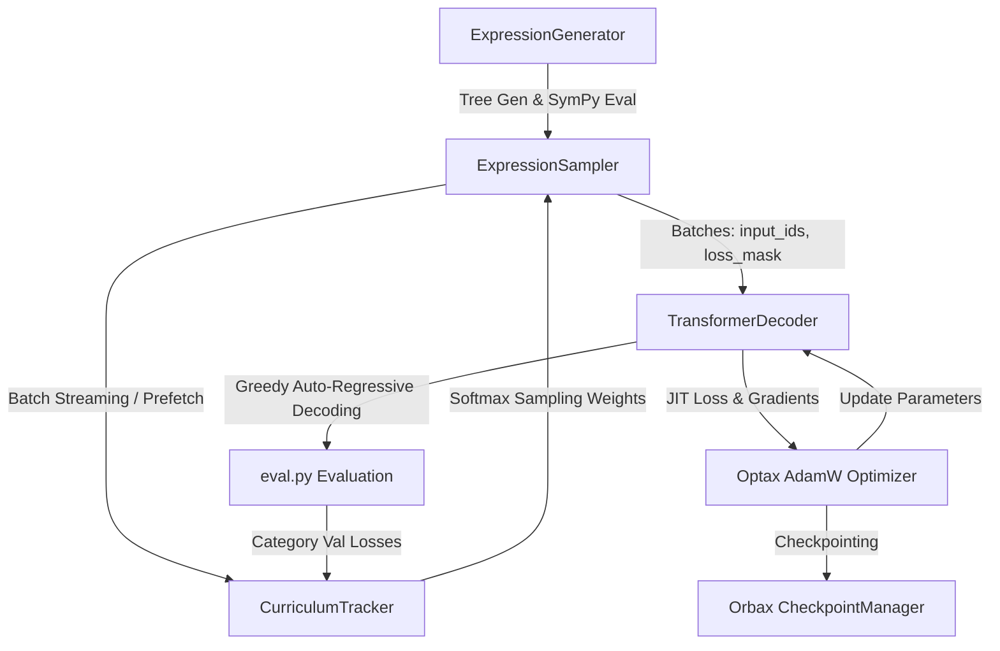

# Mathematical Operations Learning with JAX & Flax

[](https://github.com/google/jax)
[](https://github.com/google/flax)
[](https://github.com/deepmind/optax)
[](MEMORY_BOOK.md)

A device-agnostic, CPU-to-GPU-scalable **JAX/Flax** codebase for training a **Pre-LN Decoder-Only Transformer** to perform mathematical operations, including arithmetic, trigonometry, logarithms, exponentials, roots, and nested compositions.

The training pipeline features an **on-the-fly, adaptive curriculum data generator** that dynamically updates sampling weights based on category-level training and validation losses, actively suppresses overfitted tasks, and prevents category starvation.

> 📖 **Deep Dive Documentation**: For exhaustive architectural details, mathematical sequence representations, component maps, and design decisions, consult the **[Codebase Memory Book](MEMORY_BOOK.md)**.

---

## 🛠 Key Features

- **Unified Decoder Sequence Model**: Treats formula evaluation as sequence completion (`BOS <expr> SEP <result> EOS PAD...`) with target-only cross-entropy loss masking.
- **Digit-by-Digit Tokenization**: Splits numbers into individual digit tokens to maintain a fixed 30-token vocabulary and force base-10 value representation learning.
- **Adaptive Curriculum Engine**: Real-time Exponential Moving Average (EMA) tracking of per-task losses, Softmax sampling probability adjustment, overfit detection, and floor-probability starvation protection.
- **Safe Symbolic Tree Generator**: Built-in SymPy integration for safe ground-truth calculation with domain bounds preventing zero division, complex outputs, overflow, and non-real numbers.
- **Flexible Data Pipelines**: Live background-threaded batch streaming or zero-memory disk streaming from sharded `.jsonl` bulk datasets.
- **Mixed Precision & Scalability**: Seamless switching between CPU development (`float32`, learned position embeddings) and high-throughput GPU training (`bfloat16`, sinusoidal position embeddings).

---

## 🏛 System Architecture

### Sequence Layout & Masking

```text
Input Sequence:   [BOS]  "s" "i" "n" "(" "0" "." "5" ")" [SEP]  "0" "." "5" [EOS] [PAD] ...
Loss Mask:          0     0   0   0   0   0   0   0   0    0     1   1   1    1     0   ...
                                                           ^
                                                           └─ Gradients backpropagated ONLY here
```

### High-Level Data Flow



---

## 📁 Directory Structure

```text
├── MEMORY_BOOK.md              # Complete codebase reference & architectural memory
├── README.md                   # Project overview & quickstart guide
├── requirements.txt            # System dependencies
├── configs/
│   ├── cpu_dev.yaml            # Fast local CPU smoke-test configuration
│   └── gpu_train.yaml          # Scaled bfloat16 GPU production training config
├── scripts/
│   └── generate_dataset.py     # Sharded offline JSONL dataset generator
├── src/
│   ├── train.py                # Main CLI training entry point & JIT step functions
│   ├── eval.py                 # Greedy auto-regressive decoder & accuracy evaluators
│   ├── tokenizer/
│   │   ├── tokenizer.py        # Tokenizer class (digit-by-digit, fixed 30-token vocab)
│   │   └── vocab.json          # Vocabulary mapping dictionary
│   ├── data/
│   │   ├── generator.py        # ExpressionGenerator (tree generation & SymPy safety)
│   │   ├── sampler.py          # ExpressionSampler (streaming, prefetching, offline sharding)
│   │   └── curriculum.py       # CurriculumTracker (loss EMA, overfit mitigation, softmax weights)
│   └── model/
│       └── transformer.py      # TransformerDecoder (Flax Pre-LN, Learned vs. Sinusoidal)
└── tests/                      # Pytest unit test suite
    ├── test_tokenizer.py
    ├── test_data.py
    ├── test_curriculum.py
    ├── test_model.py
    └── test_train.py
```

---

## 🚀 Getting Started

### 1. Installation

Install dependencies for CPU-only mode:

```bash
pip install -r requirements.txt
```

*(For GPU acceleration, install JAX with CUDA support: `pip install "jax[cuda12]"`)*

---

### 2. CPU Smoke Test

Run an end-to-end 120-step smoke test verifying data generation, forward/backward passes, adaptive curriculum updates, validation evaluation, and Orbax checkpointing:

```bash
PYTHONPATH=. python3 src/train.py --config configs/cpu_dev.yaml --device_profile cpu_dev
```

---

### 3. GPU Production Training

Scale up seamlessly to high-throughput GPU training with `bfloat16` mixed precision and sinusoidal position embeddings:

```bash
PYTHONPATH=. python3 src/train.py --config configs/gpu_train.yaml --device_profile gpu_train
```

---

## 🎯 Adaptive Curriculum Engine

The `CurriculumTracker` manages task difficulty dynamically across `(operator, depth)` buckets (e.g. `sin_d1`, `+_d2`).

1. **Loss Tracking**: Computes Exponential Moving Averages (EMA) of training and validation losses per category.
2. **Overfitting Mitigation**: If $L_{train} < \text{threshold}$ and $L_{val} > L_{train} \times \text{ratio}$, effective loss is scaled down by $\text{overfit\_decay}$ ($0.1$) to prevent over-sampling memorized categories.
3. **Softmax Weight Allocation**: Effective losses are mapped to sampling probabilities:
   $$P_c \propto \exp\left(\frac{L^{eff}_c}{T}\right)$$
4. **Starvation Protection**: Enforces a `floor_prob` baseline so solved tasks are periodically re-sampled.

---

## 💾 Bulk Offline Dataset Generation

To pre-compute static sharded JSONL datasets on disk:

```bash
PYTHONPATH=. python3 scripts/generate_dataset.py \
    --config configs/cpu_dev.yaml \
    --output_dir ./offline_dataset \
    --num_examples 100000 \
    --shard_size 10000
```

The resulting dataset can be streamed with zero memory footprint using `ExpressionSampler.stream_offline_dataset`.

---

## 🧪 Unit Testing

Run the full unit test suite covering tokenization, data tree generation, curriculum weight shifts, model forward passes, NaN safeguards, and batch overfitting:

```bash
python3 -m pytest tests
```

---

## 📚 Complete Codebase Memory

For in-depth explanations of every module, hyperparameter matrix, API conventions, and developer guidelines, see **[MEMORY_BOOK.md](MEMORY_BOOK.md)**.
